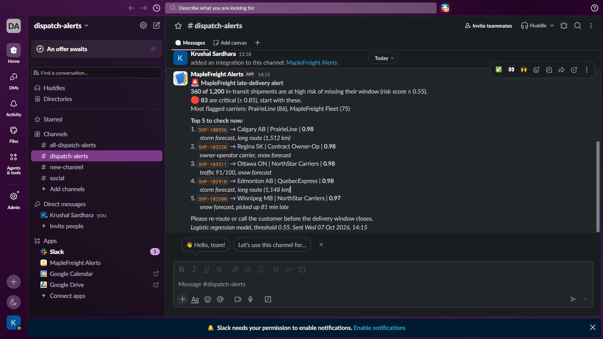

# MapleFreight Delivery Delay Prediction and Slack Alerts

**AML 3303, Assessment 1** | Krushal Sardhara (Student ID: c0966419)

A machine learning system that predicts which shipments are likely to arrive late and posts the riskiest ones to a Slack channel (`#dispatch-alerts`), so dispatch can re-route or warn the customer before the delivery window closes.



## The problem

MapleFreight Logistics moves about 8,000 shipments a week across Ontario, Quebec and the Prairies. On-time performance has dropped from 94% to 88% this year, and every late delivery costs service credits and re-delivery charges. Right now the company only finds out a shipment is late when the customer calls.

The goal is to flag high-risk shipments **at dispatch time**, using only information that is available when the truck leaves, and to alert dispatch automatically.

## Dataset

`maplefreight_delivery_delay_dataset.csv` (included in this repository): 6,035 shipments and 23 columns covering route, carrier, service level, goods type, weather forecast, traffic, driver and vehicle details. The target is `delivered_late` (1 = missed the promised window). About 21% of shipments are late.

The export is raw. The problems I found and how I fixed them:

| Problem | Rows | Fix |
|---|---|---|
| `service_level` in lower case ("standard" vs "Standard") | 120 | Converted to title case **before** removing duplicates |
| Duplicate shipments | 35 | 34 exact copies dropped, plus 1 conflicting copy of the same ID (kept the first) |
| `weight_kg` recorded in grams (170,900 to 2,999,300) | 40 | Divided by 1,000, which puts them back in the normal 30 to 5,000 kg range |
| Missing `weather_condition` | 150 | New category "Unknown" |
| Missing driver experience, traffic index, fuel cost | 570 | Median imputation inside the model pipeline (fitted on training data only) |
| `actual_transit_hours` is only known after delivery | all | Dropped, because it leaks the answer |

After cleaning: 6,000 unique shipments, 20.6% late.

## Repository contents

```
├── MapleFreight_Delivery_Delay_Prediction_c0966419.ipynb   # full notebook, run top to bottom with outputs
├── maplefreight_delivery_delay_dataset.csv                 # raw dataset
├── README.md
├── requirements.txt
├── .env.example                                            # template for the Slack webhook (no real URL)
├── .gitignore                                              # includes .env
└── screenshots/
    └── slack_alert.png                                     # the alert as it appeared in Slack
```

## How to run

1. **Clone the repository and install the libraries** (Python 3.10 or newer):

   ```bash
   git clone https://github.com/Krushal16/Software-Tools-and-Emerging.git
   cd Software-Tools-and-Emerging/maplefreight-delay-prediction
   python -m venv .venv
   source .venv/bin/activate          # Windows: .venv\Scripts\activate
   pip install -r requirements.txt
   ```

2. **Set up Slack** (only needed for the alert cell):
   * Create a free Slack workspace and a channel called `#dispatch-alerts`.
   * Go to https://api.slack.com/apps, choose **Create New App > From scratch**, open **Incoming Webhooks**, switch it on and click **Add New Webhook to Workspace**. Pick `#dispatch-alerts`.
   * Copy the template and paste the webhook URL into it:

     ```bash
     cp .env.example .env               # Windows: copy .env.example .env
     ```

     ```
     SLACK_WEBHOOK_URL=https://hooks.slack.com/services/...
     ```

3. **Run the notebook from a clean kernel:**

   ```bash
   jupyter notebook MapleFreight_Delivery_Delay_Prediction_c0966419.ipynb
   ```

   Then use **Kernel > Restart & Run All**. The whole notebook takes about a minute. If `.env` is missing, the Slack cell prints a preview of the message instead of sending it, so the rest of the notebook still runs.

**Security:** the webhook URL is read with `python-dotenv` and is never printed. `.env` is listed in `.gitignore`, and only `.env.example` (with an empty value) is committed.

## Approach

1. **Data understanding and audit:** checked types, missing values, duplicates, spellings, unit errors and leakage.
2. **EDA:** late rate by carrier, weather, service level, stops, pickup delay, traffic and month.
3. **Feature engineering:** `winter_month`, `severe_weather`, `planned_speed_kmh`, `pickup_delay_share`, `traffic_x_congestion`. Only `winter_month` added value in cross-validation and stayed in the final model.
4. **Modelling:** 80/20 stratified split, 5-fold stratified cross-validation on the training set. Imbalance handled with `class_weight="balanced"` and a tuned decision threshold.
5. **Threshold choice:** based on out-of-fold predictions and a simple cost model (see below).
6. **Evaluation:** one-time test on the 1,200 held-out shipments.
7. **Explainability:** coefficients, permutation importance and per-shipment contributions.
8. **Slack alert:** count of at-risk shipments, number of critical ones, and the top 5 with ID, destination, carrier, risk score and the two main reasons.

## Results

### Model comparison (5-fold cross-validation, training set)

| Model | ROC-AUC | PR-AUC | Recall @0.5 | F1 @0.5 |
|---|---|---|---|---|
| Dummy (always "on time") | 0.500 | 0.206 | 0.000 | 0.000 |
| **Baseline:** logistic regression, all columns, no weighting | 0.811 | 0.563 | 0.329 | 0.432 |
| Logistic regression, balanced, all + engineered features | 0.809 | 0.561 | 0.723 | 0.531 |
| **Final:** logistic regression, balanced, selected features (C = 3) | **0.817** | **0.571** | **0.744** | **0.541** |
| Random forest, balanced | 0.791 | 0.523 | 0.381 | 0.452 |
| Gradient boosting, balanced, tuned | 0.797 | 0.539 | 0.686 | 0.509 |

The tree models did not beat logistic regression. The EDA showed that each risk factor raises the late rate in a steady, additive way, which a linear model captures well. The final model is also the easiest to explain to dispatch.

### Test set (1,200 shipments, 247 late)

| Model | Threshold | Precision | Recall | F1 | Accuracy | ROC-AUC | Late caught | Missed | False alarms |
|---|---|---|---|---|---|---|---|---|---|
| Dummy | 0.50 | 0.000 | 0.000 | 0.000 | 0.794 | 0.500 | 0 | 247 | 0 |
| Baseline LR | 0.50 | 0.696 | 0.352 | 0.468 | 0.835 | 0.829 | 87 | 160 | 38 |
| Final LR | 0.50 | 0.442 | 0.741 | 0.554 | 0.754 | 0.838 | 183 | 64 | 231 |
| **Final LR** | **0.55** | **0.483** | **0.704** | **0.573** | 0.784 | 0.838 | **174** | 73 | 186 |

**Confusion matrix, final model at 0.55**

|  | Predicted on time | Predicted late |
|---|---|---|
| **Actually on time** | 767 | 186 |
| **Actually late** | 73 | 174 |

The final model catches **twice as many late shipments** as the baseline (174 vs 87). At 8,000 shipments a week that is roughly 1,160 late deliveries flagged in advance, compared with 580.

## Chosen threshold: 0.55, and why

A missed late shipment costs far more than a false alarm, so the threshold should favour recall. But if too many alerts are wrong, dispatchers stop reading them. I used these assumptions (to be replaced with real figures from finance):

* Late delivery costs about CAD 250 (service credit and re-delivery). Early warning avoids about half of that, so **CAD 125 saved** per late shipment caught.
* Each alert costs about **CAD 20** of dispatcher time, whether it is right or wrong.
* Precision must stay at **0.45 or higher** (at least 9 real problems in every 20 alerts).

Using out-of-fold predictions on the training set (not the test set), I picked the threshold with the highest weekly saving that meets the precision rule. That is **0.55**:

* It catches about 69% of late shipments with 46% precision (out-of-fold).
* It keeps about 95% of the maximum possible saving (CAD 91,900 vs 96,300 per week), while sending about 800 fewer alerts a week than the saving-maximising threshold of 0.45, where precision falls to 0.39.
* It is next to the best-F1 threshold (0.549 at 0.55 vs 0.550 at 0.60).

The alert also marks shipments with a score of **0.85 or above** as critical, so dispatch knows where to start.

## Key findings

* **Weather forecast:** late rate goes from 14% (clear) to 34% (snow) and 46% (storm).
* **Carrier:** contract owner-operators are late on 36% of loads, almost three times the company's own fleet (13%).
* **Stops and traffic:** 12% late with no stops vs 29% with five; 12% at low traffic vs 35% at a traffic index above 85.
* **Pickup delay:** a pickup more than 30 minutes late raises the late rate to about 27% (15% for on-time pickups).
* **Driver experience** is the main protective factor.
* **Winter (Dec to Feb)** adds risk beyond the forecast: even on clear-forecast days, 17% are late vs 13% in other months.
* **Customer tier makes no difference** (20.4% to 20.7%), so Gold customers do not get better on-time service than Bronze.
* By permutation importance, the most important inputs are distance and weather, followed by traffic, carrier, number of stops, pickup delay and route congestion.

## Recommendations

1. Review owner-operator contracts and move time-sensitive loads (Express, refrigerated, Gold) to the company fleet.
2. Add buffer time or warn customers at booking when snow or storms are forecast.
3. Trigger a dispatch check automatically for any pickup that is 30+ minutes late.
4. Give routes with four or more stops more scheduled time, or split them.
5. Avoid giving new drivers long, multi-stop, high-traffic routes in winter.
6. Share a weekly carrier scorecard based on late deliveries in the last 30 days.
7. Give Gold accounts the lower-risk carriers and service levels first.
8. Review the 0.55 threshold monthly with real cost data, and record what dispatch does with each alert so the model can be improved.

## Limitations

* The split is random because the data has a month but no year or date. In production the model should be tested on later months.
* Class weighting makes risk scores higher than the true probability. They rank shipments well, but should be calibrated if dispatch needs real percentages.
* The cost figures behind the threshold are assumptions.
* The model scores shipments only at dispatch. Live GPS and updated ETAs would let the risk be updated during the trip.

## AI usage

**Tool used:** Claude (Anthropic), as allowed by the brief.

**What I used it for:** help with planning the workflow, writing and debugging the pandas and scikit-learn code, building the Slack message format, and drafting and proofreading the written findings and this README. All results in the notebook come from code that was run, and I checked the written numbers against the cell outputs.

**A case where the output was wrong:** in the first draft of the explainability section, the AI-written finding said that **carrier** was the most important feature. When I compared the text with the permutation importance output, it did not match: distance and weather forecast were clearly on top (each lowers test PR-AUC by about 0.14 when shuffled), and carrier was fourth (about 0.07). I rewrote the finding to follow the actual output. A smaller error in the same session: the suggested plotting code called `RocCurveDisplay.from_predictions(..., color=...)`, which crashed with a `TypeError` in scikit-learn 1.9. I replaced it with `roc_curve`, `precision_recall_curve` and plain matplotlib, which works across versions.

**What I learned:** AI-generated text can sound confident and still contradict the output right above it, so every claim in a finding has to be checked against the actual numbers.
